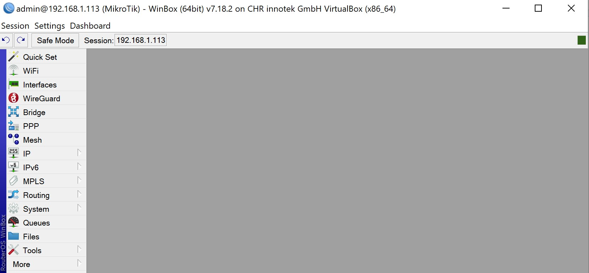

University: [ITMO University](https://itmo.ru/ru/)

Faculty: [FICT](https://fict.itmo.ru)

Course: [Network programming](https://github.com/itmo-ict-faculty/network-programming)

Year: 2024/2025

Group: K3320

Author: Shimchenko Alexandra Sergeevna

Lab: Lab1

Date of create: 26.03.2025

Date of finished: 5.04.2025

# Отчет по лабораторной работе №1 "Установка CHR и Ansible, настройка VPN" #

## Цель работы: ##
Целью данной работы является развертывание виртуальной машины на базе платформы Microsoft Azure с установленной системой контроля конфигураций Ansible и установка CHR в VirtualBox

## Ход работы: ##

### Создание виртуальной машины Ubuntu в Selectel ###
В начале создаётся виртуальная машина со следующими параметрами


### Создание виртуальной машины RouterOS и подключение к ней через WinBox ###
С официального сайта MikroTik был скачан образ RouterOS и установлен с помощью VirtualBox


Также был настроен сетевой мост


С помощью Winbox подключимся к CHR (используя логин, пароль и ip)


Подключение произошло успешно 



### Настройка VPN сервера ###

Также установим Pyhton и Ansible для виртуальной машины Ubuntu
Для этого пропишем команды:

```
sudo apt update
sudo apt install python3-pip
sudo pip3 install ansible
```

Для организации VPN-туннеля между сервером автоматизации и локальным компьютером был развернут OpenVPN-сервер через AmneziaVPN. В настройках отключены TLS-авторизация и блокировка DNS-запросов вне VPN, а также выбраны алгоритмы шифрования SHA256 (для аутентификации) и AES-256-GCM (для передачи данных). 


С помощью OpenVPN Connect запущен экспортированный из AmneziaVPN `.ovpn`-файл, после этого VPN-туннель был успешно установлен. 


Внешний IP-адрес сервера — `31.129.45.104`, что подтверждает корректность маршрутизации трафика через VPN.


### Работа с CHR ###

В WinBox добавлен ранее загруженный файл.


Конфигурация импортирована в раздел PPP (OVPN Client) и успещно запущена


Проверяем связность устройств с помощью ping


## Вывод ##

В результате выполнения лабораторной работы были получены навыки по развертыванию виртуальной машины на платформе Selectel. Также был установлен CHR в VirtualBox и настроен VPN-туннель между сервером и клиентом.
