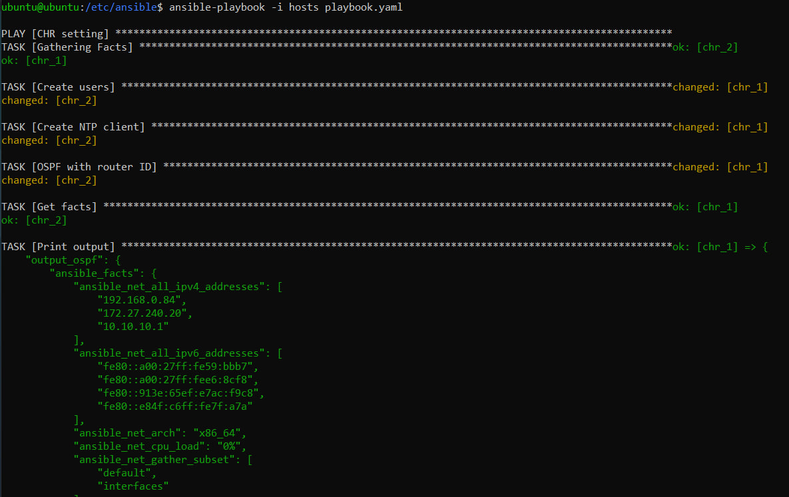
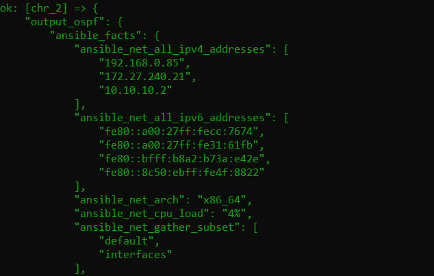
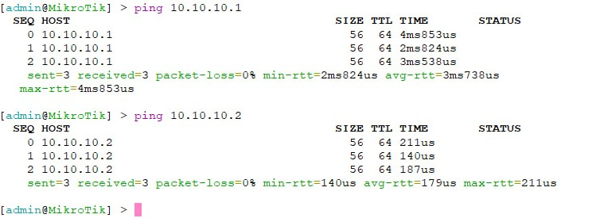
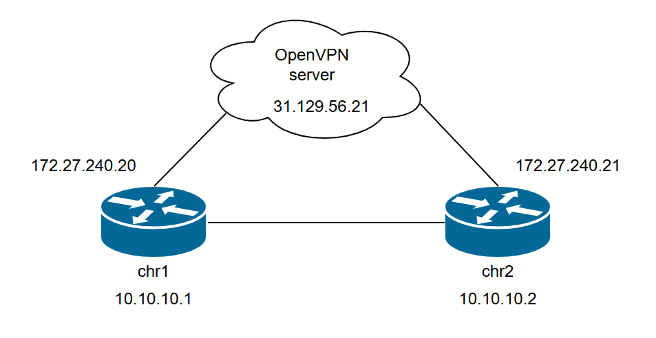

University: [ITMO University](https://itmo.ru/ru/)

Faculty: [FICT](https://fict.itmo.ru)

Course: [Network programming](https://github.com/itmo-ict-faculty/network-programming)

Year: 2024/2025

Group: K3320

Author: Shimchenko Alexandra Sergeevna

Lab: Lab2

Date of create: 20.05.2025

Date of finished: 6.06.2025

# Отчет по лабораторной работе №2 "Развертывание дополнительного CHR, первый сценарий Ansible" #

## Цель работы: ##
С помощью Ansible настроить несколько сетевых устройств и собрать информацию о них. Правильно собрать файл Inventory.

## Ход работы: ##


### Развертывание 2 CHR  ###
На ПК были развернуты два экземпляра MikroTik CHR. Для второго устройства был создан отдельный виртуальный диск, и вручную был установлен OVPN-клиент (по аналогии с первой лабораторной работой). Оба CHR были успешно подключены к OpenVPN-серверу, сформировав логическую сеть, в которой Ansible имеет доступ к обоим маршрутизаторам через VPN:
```
chr_1 — IP: 172.27.240.20, Router ID: 10.10.10.1

chr_2 — IP: 172.27.240.21, Router ID: 10.10.10.2
```

### Inventory-файл (hosts.ini) ###
Создан inventory-файл для указания устройств и параметров подключения:
```
[routers]
chr_1 ansible_host=172.27.240.20 ansible_ssh_pass=123 router_id=10.10.10.1
chr_2 ansible_host=172.27.240.21 ansible_ssh_pass=123 router_id=10.10.10.2

[routers:vars]
ansible_connection=ansible.netcommon.network_cli
ansible_network_os=community.routeros.routeros
ansible_user=admin
```
### Ansible Playbook (playbook.yaml) ###

Основные задачи:
1. Используется community.routeros.facts для получения базовой информации об устройстве

2. Через community.routeros.api_modify добавляется пользователь newuser с паролем password и правами read

3. Включается NTP-клиент с сервером pool.ntp.org для синхронизации времени

4. Настройка OSPF

    - Создаётся интерфейс loopback0;

    - Назначается IP-адрес как Router ID;

    - Добавляется OSPF-инстанс и зона backbone;

    - Настраивается шаблон интерфейса для включения всех сетей.

5. Выполняется сбор обновлённых данных и выводятся параметры OSPF для проверки конфигурации.

```
- name: CHR setting
  hosts: routers
  gather_facts: false

  module_defaults:
    group/community.routeros.api:
      hostname: "{{ inventory_hostname }}"
      username: "{{ ansible_user }}"
      password: "{{ ansible_ssh_pass }}"

  tasks:

    - name: Gathering Facts
      community.routeros.facts:
        gather_subset: all

    - name: Create users
      community.routeros.api_modify:
        path: user
        data:
          - name: newuser
            password: password
            group: read

    - name: Create NTP client
      community.routeros.api_modify:
        path: system ntp client
        data:
          - enabled: true
            servers: pool.ntp.org

    - name: OSPF with router ID
      block:
        - name: Add loopback interface
          community.routeros.api_modify:
            path: interface bridge
            data:
              - name: loopback0

        - name: Assign router ID IP to loopback
          community.routeros.api_modify:
            path: ip address
            data:
              - address: "{{ router_id }}/32"
                interface: loopback0

        - name: Create OSPF instance
          community.routeros.api_modify:
            path: routing ospf instance
            data:
              - name: v2inst
                version: 2
                router-id: "{{ router_id }}"

        - name: Add OSPF area
          community.routeros.api_modify:
            path: routing ospf area
            data:
              - name: bbone
                area-id: 0.0.0.0
                instance: v2inst

        - name: Add OSPF interface-template
          community.routeros.api_modify:
            path: routing ospf interface-template
            data:
              - networks: 0.0.0.0/0
                area: bbone

    - name: Get facts
      community.routeros.facts:
        gather_subset: all

    - name: Print output
      debug:
        var: output_ospf
      vars:
        output_ospf: "{{ ansible_facts }}"

```


# Запуск playbook и вывод результатов    
После запуска файла `ansible-playbook -i hosts.ini playbook.yaml` получаем :  


  
 
 
  
# Проверка настройки 

Результаты пингов, проверки локальной связности:  


# Схема сети   


---  
# Вывод
Лабораторная работа продемонстрировала возможности Ansible для автоматизации настройки сетевых устройств. Была успешно выполнена централизованная настройка двух CHR через Ansible; включение NTP и настройка OSPF с Router ID; установление OSPF-соседства и успешный обмен маршрутами; экспорт конфигурации в локальные файлы.
