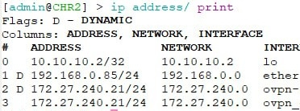
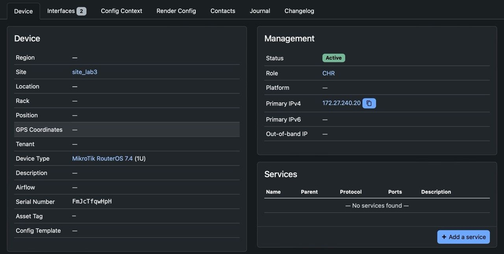
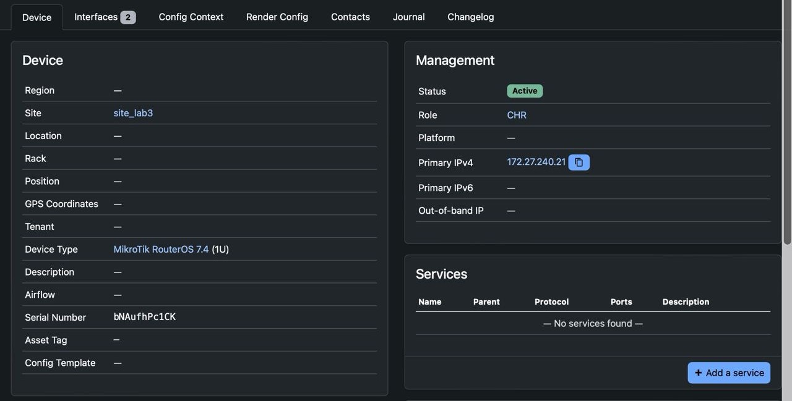

University: [ITMO University](https://itmo.ru/ru/)

Faculty: [FICT](https://fict.itmo.ru)

Course: [Network programming](https://github.com/itmo-ict-faculty/network-programming)

Year: 2024/2025

Group: K3320

Author: Shimchenko Alexandra Sergeevna

Lab: Lab3

Date of create: 2.06.2025

Date of finished: 8.06.2025

# Отчет по лабораторной работе №3 "Развертывание Netbox, сеть связи как источник правды в системе технического учета Netbox" #

## Цель работы: ##
С помощью Ansible и Netbox собрать всю возможную информацию об устройствах и сохранить их в отдельном файле.

## Ход работы: ##


#  Установка Netbox  
Для установки NetBox использовалась [инструкция](https://docs.netbox.dev/en/stable/installation/).
1. Установка PostgreSQL и создание БД
```
sudo apt install postgresql libpq-dev -y
sudo systemctl start postgresql
sudo systemctl enable postgresql
sudo passwd postgres
su - postgres
```
Внутри psql создаём базу данных и пользователя:

```
CREATE DATABASE netbox;
CREATE USER netbox WITH ENCRYPTED password '123';
GRANT ALL PRIVILEGES ON DATABASE netbox TO netbox;
```
2. Установка Redis
```
sudo apt install -y redis-server
```

3. Установка зависимостей для NetBox
```
sudo apt install python3 python3-pip python3-venv python3-dev build-essential \
libxml2-dev libxslt1-dev libffi-dev libpq-dev libssl-dev zlib1g-dev git -y
sudo pip3 install --upgrade pip
```
4. Настройка конфигурации NetBox
```
cd /opt/netbox/netbox/netbox/
sudo cp configuration.example.py configuration.py
sudo ln -s /usr/bin/python3 /usr/bin/python
sudo /opt/netbox/netbox/generate_secret_key.py
```
5. Обновление и запуск NetBox
```
sudo /opt/netbox/upgrade.sh
source /opt/netbox/venv/bin/activate
cd /opt/netbox/netbox
python3 manage.py createsuperuser
sudo reboot
```
6. Установка и настройка Nginx
```
sudo apt install -y nginx
sudo cp /opt/netbox/contrib/nginx.conf /etc/nginx/sites-available/netbox
```
```
sudo rm /etc/nginx/sites-enabled/default
sudo ln -s /etc/nginx/sites-available/netbox /etc/nginx/sites-enabled/netbox
sudo systemctl restart nginx
```
После активации конфигурации и перезапуска Nginx NetBox становится доступен через браузер 

# Настройка Netbox в браузере 
После успешного входа в веб-интерфейс NetBox под учетной записью администратора в разделе Devices были добавлены два сетевых устройства.
 
 

# Работа с Ansible 
Создаем inventory-файл для сохранения всех данных
```
plugin: netbox.netbox.nb_inventory
api_endpoint: http://31.129.56.21:8080/
token: "токен"
validate_certs: False
config_context: False
interfaces: True
```
Запустили роль, сохранив вывод в файл [netbox_inventory.yml](./netbox_inventory.yml)
```
ansible-inventory -v --list -y -i netbox_conf_galaxy.yml > netbox_inventory.yml
```
### Первый сценарий ###

В рамках созданного playbook были реализованы задачи по автоматической настройке сетевых устройств. В частности, выполнены следующие действия:

- Изменение имени устройства на то, которое указано в системе NetBox;

- Добавление IP-адреса (выданного через VPN) на новое сетевое устройство.
```
- name: Configuration
  hosts: devices
  tasks:
    - name: Set Name
      community.routeros.command:
        commands:
          - /system identity set name="{{interfaces[0].device.name}}"
    - name: Set IP-address
      community.routeros.command:
        commands:
        - /interface bridge add name="{{interfaces[1].display}}"
        - /ip address add address="{{interfaces[1].ip_addresses[0].address}}" interface="{{interfaces[1].display}}"
```
Обе задачи были успешно выполнены. В результате имя устройства было изменено (ранее использовалось имя по умолчанию — MikroTik), а также был добавлен IP-адрес на новый интерфейс, созданный в ходе выполнения playbook. 

 
 

### Второй сценарий ### 
На следующем этапе playbook был доработан с целью автоматического получения серийного номера с каждого устройства и последующего внесения этой информации в систему NetBox.
```
- name: Serial Numbers
  hosts: devices
  tasks:
    - name: Serial Number
      community.routeros.command:
        commands:
          - /system license print
      register: license
    - name: Add Serial Number
      netbox_device:
        netbox_url: http://31.129.56.21:8080/
        netbox_token: "токен"
        data:
          name: "{{interfaces[0].device.name}}"
          serial: "{{license.stdout_lines[0][0].split(' ').1}}"
        state: present
        validate_certs: False
```
Как результат, в веб-интерфейсе NetBox для каждого CHR отобразился соответствующий серийный номер:
  
  


---  
# Вывод
В рамках работы была развернута система NetBox на отдельной виртуальной машине и внесена информация о двух устройствах MikroTik CHR. С помощью Ansible были:

- выгружены данные из NetBox в файл;

- реализован сценарий настройки CHR: изменение имени и добавление IP-адреса;

- написан скрипт для сбора серийного номера и его отправки в NetBox.

Все задачи выполнены успешно, автоматизация настроек и интеграция с NetBox работают корректно.
