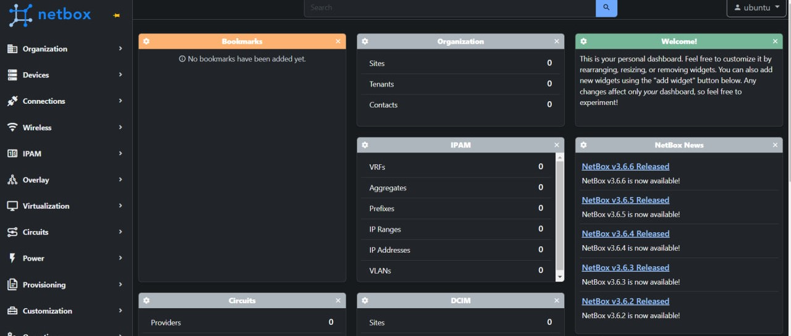
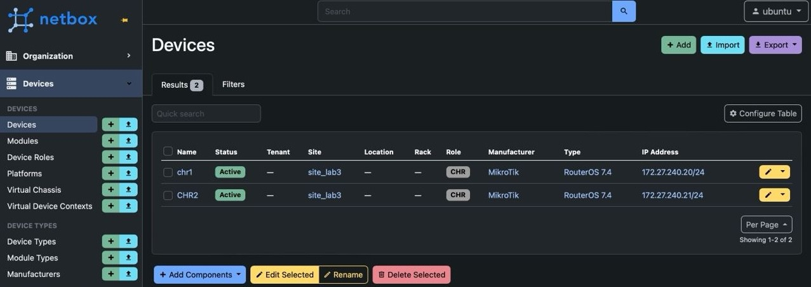
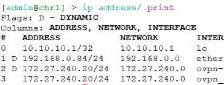

University: [ITMO University](https://itmo.ru/ru/)

Faculty: [FICT](https://fict.itmo.ru)

Course: [Network programming](https://github.com/itmo-ict-faculty/network-programming)

Year: 2024/2025

Group: K3320

Author: Shimchenko Alexandra Sergeevna

Lab: Lab3

Date of create: 2.06.2025

Date of finished: 8.06.2025

# Отчет по лабораторной работе №3 "Развертывание Netbox, сеть связи как источник правды в системе технического учета Netbox" #

## Цель работы: ##
С помощью Ansible и Netbox собрать всю возможную информацию об устройствах и сохранить их в отдельном файле.

## Ход работы: ##


###  Установка Netbox  ###
Для установки NetBox использовалась [инструкция](https://docs.netbox.dev/en/stable/installation/).
1. Установка PostgreSQL и создание БД
```
sudo apt install postgresql libpq-dev -y
sudo systemctl start postgresql
sudo systemctl enable postgresql
sudo passwd postgres
su - postgres
```
Внутри psql создаём базу данных и пользователя:

```
CREATE DATABASE netbox;
CREATE USER netbox WITH ENCRYPTED password '123';
GRANT ALL PRIVILEGES ON DATABASE netbox TO netbox;
```
2. Установка Redis
```
sudo apt install -y redis-server
```

3. Установка зависимостей для NetBox
```
sudo apt install python3 python3-pip python3-venv python3-dev build-essential \
libxml2-dev libxslt1-dev libffi-dev libpq-dev libssl-dev zlib1g-dev git -y
sudo pip3 install --upgrade pip
```
4. Настройка конфигурации NetBox
```
cd /opt/netbox/netbox/netbox/
sudo cp configuration.example.py configuration.py
sudo ln -s /usr/bin/python3 /usr/bin/python
sudo /opt/netbox/netbox/generate_secret_key.py
```
5. Обновление и запуск NetBox
```
sudo /opt/netbox/upgrade.sh
source /opt/netbox/venv/bin/activate
cd /opt/netbox/netbox
python3 manage.py createsuperuser
sudo reboot
```
6. Установка и настройка Nginx
```
sudo apt install -y nginx
sudo cp /opt/netbox/contrib/nginx.conf /etc/nginx/sites-available/netbox
```
```
sudo rm /etc/nginx/sites-enabled/default
sudo ln -s /etc/nginx/sites-available/netbox /etc/nginx/sites-enabled/netbox
sudo systemctl restart nginx
```
После активации конфигурации и перезапуска Nginx NetBox становится доступен через браузер 
### Inventory-файл (hosts.ini) ###
Создан inventory-файл для указания устройств и параметров подключения:
```
[routers]
chr_1 ansible_host=172.27.240.20 ansible_ssh_pass=123 router_id=10.10.10.1
chr_2 ansible_host=172.27.240.21 ansible_ssh_pass=123 router_id=10.10.10.2

[routers:vars]
ansible_connection=ansible.netcommon.network_cli
ansible_network_os=community.routeros.routeros
ansible_user=admin
```
### Настройка Netbox в браузере ###
После успешного входа в веб-интерфейс NetBox под учетной записью администратора в разделе Devices были добавлены два сетевых устройства.
    интерфейс экрана
    2 роутера интерфейс
 
  
# Проверка настройки 

Результаты пингов, проверки локальной связности:  


# Схема сети   


---  
# Вывод
Лабораторная работа продемонстрировала возможности Ansible для автоматизации настройки сетевых устройств. 
