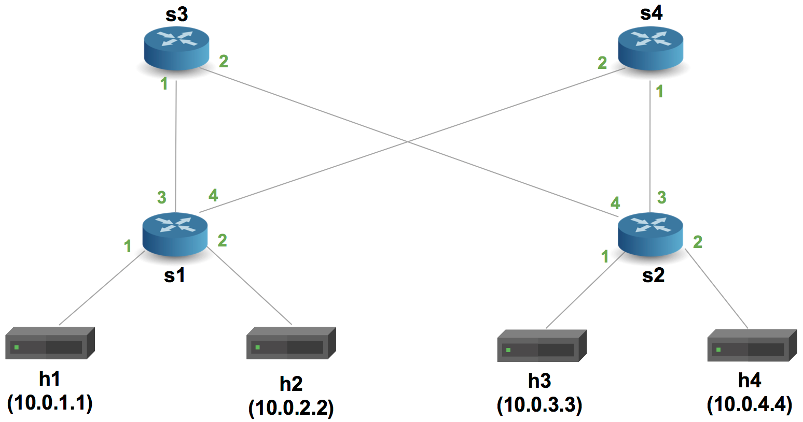
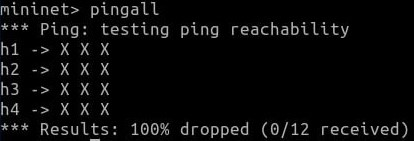
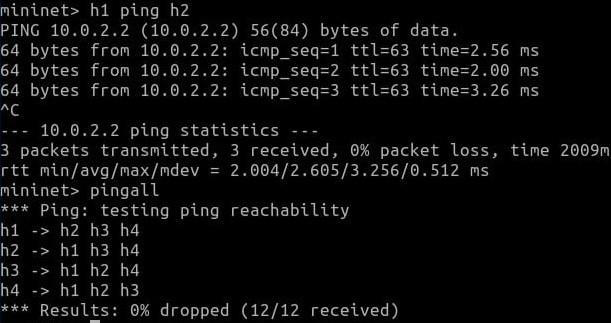
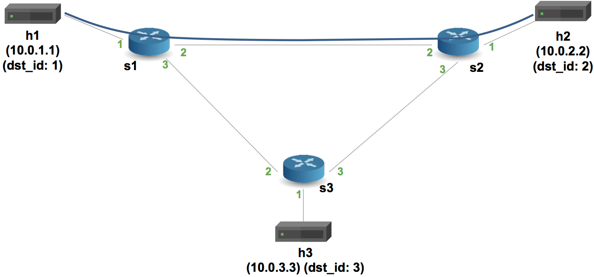
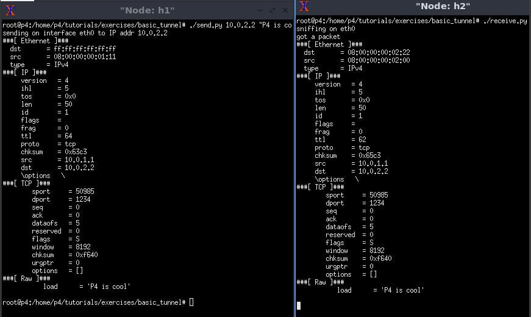
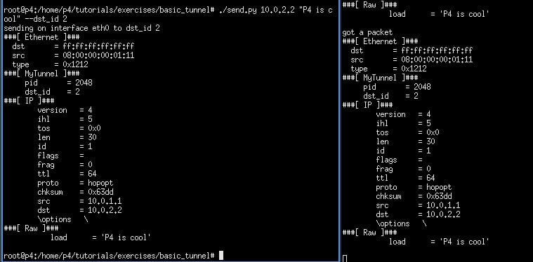
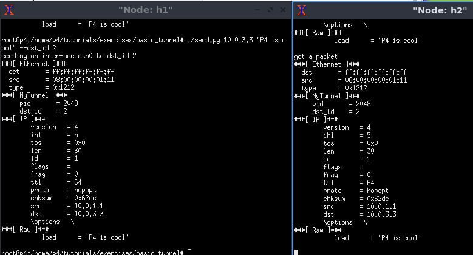

University: [ITMO University](https://itmo.ru/ru/)

Faculty: [FICT](https://fict.itmo.ru)

Course: [Network programming](https://github.com/itmo-ict-faculty/network-programming)

Year: 2024/2025

Group: K3320

Author: Shimchenko Alexandra Sergeevna

Lab: Lab4

Date of create: 5.06.2025

Date of finished: 14.06.2025

# Отчет по лабораторной работе №3 "Базовая 'коммутация' и туннелирование используя язык программирования P4" #

## Цель работы: ##
Изучить синтаксис языка программирования P4 и выполнить 2 задания обучающих задания от Open network foundation для ознакомления на практике с P4.


#  Часть 1: Реализация базовой переадресации (Basic Forwarding) #
 
В этой части работы нужно было реализовать простую маршрутизацию IP-пакетов на языке P4 с использованием предоставленной топологии. В каталоге задания находился шаблонный файл basic.p4, в котором уже были заготовлены основные элементы кода.

После запуска Mininet командой `make run`была проверена связь между хостами с помощью команды ping. На этом этапе обмен ICMP-пакетами не происходил, что указывало на отсутствие необходимой логики переадресации в P4-программе.
 
### Добавление парсера ###
В первую очередь в модуль parser была добавлена логика извлечения заголовков Ethernet и IPv4:
```
parser MyParser(packet_in packet,
                out headers hdr,
                inout metadata meta,
                inout standard_metadata_t standard_metadata) {

    state start {
        transition parse_ethernet;
    }

    state parse_ethernet {
        packet.extract(hdr.ethernet);
        transition select(hdr.ethernet.etherType) {
            TYPE_IPV4: parse_ipv4;
            default: accept;
        }
    }

    state parse_ipv4 {
        packet.extract(hdr.ipv4);
        transition accept;
    }

}
```
### Добавление действия forwarding ###
Было определено действие ipv4_forward, выполняющее переадресацию пакета на заданный порт с обновлением MAC-адресов и уменьшением TTL:
```
action ipv4_forward(macAddr_t dstAddr, egressSpec_t port) {
    standard_metadata.egress_spec = port;
    hdr.ethernet.srcAddr = hdr.ethernet.dstAddr;
    hdr.ethernet.dstAddr = dstAddr;
    hdr.ipv4.ttl = hdr.ipv4.ttl - 1;
}
```
### Добавление логики применения правил ###
В блоке apply была добавлена проверка корректности заголовка ipv4 и вызов соответствующей таблицы:
```
apply {
    if (hdr.ipv4.isValid()) {
        ipv4_lpm.apply();
    }
}
```
### Формирование ответа — депарсер ###
В модуле MyDeparser была реализована сборка выходного пакета из заголовков:

```
control MyDeparser(packet_out packet, in headers hdr) {
    apply {
        packet.emit(hdr.ethernet);
        packet.emit(hdr.ipv4);
    }
}
```

После завершения всех изменений, файл basic.p4 был сохранён. Повторный запуск make run показал успешное выполнение пинга между хостами, что свидетельствует о корректной работе переадресации.
 

# Часть 2: Реализация базового туннелирования (Basic Tunneling)
 
Следующий этап — реализация поддержки туннелирования пакетов. В качестве основы использовался предыдущий файл, теперь под названием basic_tunnel.p4. В этом задании необходимо было реализовать обработку нового заголовка myTunnel, который инкапсулирует IP-пакет и содержит поля proto_id и dst_id.

### Обновление парсера
Парсер был дополнен логикой обработки нового заголовка myTunnel. При его наличии, после Ethernet заголовка извлекается заголовок туннеля, а затем IP-заголовок (если proto_id соответствует IPv4):

```
parser MyParser(packet_in packet,
                out headers hdr,
                inout metadata meta,
                inout standard_metadata_t standard_metadata) {

    state start {
        transition parse_ethernet;
    }

    state parse_ethernet {
        packet.extract(hdr.ethernet);
        transition select(hdr.ethernet.etherType) {
            TYPE_MYTUNNEL: parse_myTunnel;
            TYPE_IPV4: parse_ipv4;
            default: accept;
        }
    }

    state parse_myTunnel {
        packet.extract(hdr.myTunnel);
        transition select(hdr.myTunnel.proto_id) {
            TYPE_IPV4: parse_ipv4;
            default: accept;
        }
    }

    state parse_ipv4 {
        packet.extract(hdr.ipv4);
        transition accept;
    }

}
```

### Добавление действия и таблицы
Было определено действие для переадресации пакетов по туннелю:

```
action myTunnel_forward(egressSpec_t port) {
    standard_metadata.egress_spec = port;
}
```
Также создана таблица для точного сопоставления поля dst_id:

```
table myTunnel_exact {
    key = {
        hdr.myTunnel.dst_id: exact;
    }
    actions = {
        myTunnel_forward;
        drop;
    }
    size = 1024;
    default_action = drop();
}
```

### Логика применения правил
В блоке apply реализована логика: если в пакете нет туннеля, выполняется обычная IP-маршрутизация; если туннель есть — применяется новая таблица:

```
apply {
    if (hdr.ipv4.isValid() && !hdr.myTunnel.isValid()) {
        // Process only non-tunneled IPv4 packets
        ipv4_lpm.apply();
    }

    if (hdr.myTunnel.isValid()) {
        // process tunneled packets
        myTunnel_exact.apply();
    }
}
```
### Дополнение депарсера
В модуль MyDeparser добавлено формирование выходного пакета с заголовком туннеля:

```
control MyDeparser(packet_out packet, in headers hdr) {
    apply {
        packet.emit(hdr.ethernet);
        packet.emit(hdr.myTunnel);
        packet.emit(hdr.ipv4);
    }
}
```
После реализации изменений, файл basic_tunnel.p4 был готов к тестированию.

### Тестирование работы туннеля
Mininet был перезапущен (предыдущая сессия остановлена с помощью make stop, затем снова выполнено make run). Открыты терминалы хостов h1 и h2.

На h2 был запущен сервер `./receive.py`. На h1 было отправлено сообщение без использования туннеля:
```
./send.py 10.0.2.2 "P4 is cool"
```
 


Пакет успешно дошёл до h2, заголовки — Ethernet + IPv4 + TCP.

Далее сообщение было отправлено с туннелированием:

```
./send.py 10.0.2.2 "P4 is cool" --dst_id 2
```
В этом случае пакет имел заголовок myTunnel, инкапсулирующий IP.
 


Также был проведён тест: отправка на 10.0.3.3 с указанием --dst_id 2, при этом сообщение снова дошло до h2, так как маршрутизация происходила по dst_id, а не по IP-адресу.
 

---  
# Вывод
В ходе лабораторной работы были выполнены два задания, направленных на изучение языка P4:

- Реализация базовой IP-маршрутизации — добавлен парсинг заголовков, определены действия переадресации и депарсинга пакетов.

- Реализация базового туннелирования — добавлен новый заголовок, реализована маршрутизация по dst_id, а также расширен депарсер для поддержки инкапсуляции.

Оба задания были протестированы в среде Mininet и показали корректную работу маршрутизатора.
